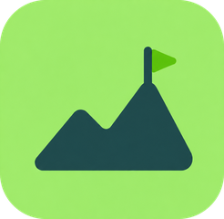

<h2 align="center">Olá 👋! Eu sou o Caio!</h2>

  Desenvolvedor full stack, fundador da <a href="https://nobilesolutions.com.br">Nobile Solutions</a>. 
  Crio sistemas web, SaaS e automações com IA.

###

  
  

###

<h3 align="center">🚀 Projetos</h3>

<table align="center">
  <tr>
    <td width="33%" valign="top">
      

        <a href="https://kdsticket.com.br">
          <picture>
            <source media="(prefers-color-scheme: dark)" srcset="./assets/kdsticket-dark.png" />
            
          </picture>
        </a>
      

      <h4>🎟️ <a href="https://kdsticket.com.br">KDS Ticket</a></h4>
      Plataforma de venda de ingressos para eventos, com checkout, split de pagamento, check-in e painel do produtor.
        
      <b>TypeScript · Node.js · Express · PostgreSQL · Redis · Next.js · Tailwind</b>
    </td>
    <td width="33%" valign="top">
      

        
      

      <h4>🧗 <a href="https://alpinefinance.com">Alpine Finance</a></h4>
      Controle financeiro pelo WhatsApp com IA: manda "gastei 50 no mercado" e ela anota, categoriza e responde suas dúvidas. Inclui painel web com gráficos.
        
      <b>TypeScript · Express · MongoDB · Next.js · IA</b>
    </td>
    <td width="33%" valign="top">
      

        
      

      <h4>💼 <a href="https://nobilesolutions.com.br">Nobile Solutions</a></h4>
      Minha empresa de desenvolvimento de software e automações com IA — sites, sistemas sob medida e integrações.
        
      <b>Next.js · TypeScript · Tailwind · Framer Motion</b>
    </td>
  </tr>
</table>

###

<h3 align="center">🛠️ Tecnologias</h3>

  
  
  
  
  
  
  
  
  
  
  
  
  
  
  

 

  
  
  
  
  
  
  
  
  
  
  
  
  

###

<h3 align="center">📫 Contato</h3>

  
  
  

###

 

